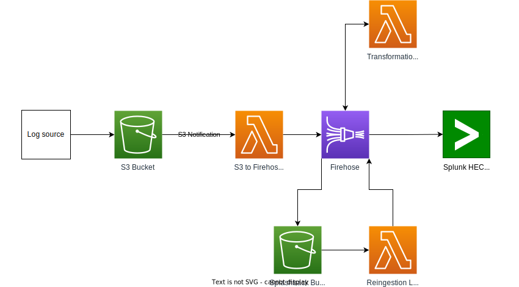

# terraform-aws-s3-to-splunk-upload

This module provides a firehose setup to pull log events from an S3 bucket and send it to Splunk.
It includes the relevant lambdas to transform the log events, a "splashback" bucket to store failed events, a lambda to reingest from the splashback bucket and cloudwatch log groups for each part of the process.

A diagram of the architecture is provided below.

## Table of Contents

- [terraform-aws-s3-to-splunk-upload](#terraform-aws-s3-to-splunk-upload)
  - [Table of Contents](#table-of-contents)
  - [Setup](#setup)
    - [Installation](#installation)
  - [Usage](#usage)
    - [Log event input](#log-event-input)
    - [Log event output](#log-event-output)
    - [Testing](#testing)
  - [Architecture](#architecture)
    - [Diagrams](#diagrams)
  - [Licence](#licence)

## Setup

Clone the repository

```shell
git clone https://github.com/nhs-england-tools/terraform-aws-s3-to-splunk-upload.git
cd nhs-england-tools/terraform-aws-s3-to-splunk-upload
```

### Installation

Install and configure toolchain dependencies

```shell
make config
```

## Usage

Example usage:

- Calling the module:

  ```js
  module "example_usage" {
    source                    = "github.com/NHSDigital/terraform-aws-s3-to-splunk-upload//terraform?ref=20231002"
    audit_logs_bucket_name    = "example-audit-log-bucket"
    splunk_hec_token          = "<<your hec token>>"
    splunk_hec_endpoint       = "https://<<domain>>/services/collector/event"
    splunk_index              = "index_name"
    splunk_host               = "host_value"
    splunk_source             = "source_value"
    splunk_sourcetype         = "sourcetype_value"
    timestamp_key             = "@timestamp"
    retention_mode            = "COMPLIANCE"  // Default is "GOVERNANCE"
    retention_period          = 4             // Default is 1
    lifecycle_expiration      = 365           // Default is 365
  }
  ```

- Defining the provider details:

  ```js
  terraform {
    required_providers {
      aws = {
        source  = "hashicorp/aws"
        version = "~> 4.38"
    }
  }
    required_version = "1.3.4"
  }


  provider "aws" {
    region = "eu-west-2"
  }
  ```

A full example of usage can be found at [ee-github-audit-logs](https://github.com/NHSDigital/ee-github-audit-logs).

### Log event input

1. Log events need to be in json format, separated by new line characters `\n` :

   ```json
   {"key 1": "value 1", "key 2": "value 2"}
   {"key 3": "value 3", "key 4": "value 4"}
   {"key 5": "value 5", "key 6": "value 6"}
   ```

2. Log events must be put into the S3 bucket in `.gz` zipped format. E.g. `log_events.json.gz`

### Log event output

The module will output logs to the specified event endpoint in the following format, separated by new line characters `\n` :

```json
{"host": "example host", "index": "example index", "source": "example source", "sourcetype": "example sourcetype", "time": 1688478560, "event": {"key 1": "value 1", "key 2": "value 2"}}
{"host": "example host", "index": "example index", "source": "example source", "sourcetype": "example sourcetype", "time": 1688478560, "event": {"key 3": "value 3", "key 4": "value 4"}}
{"host": "example host", "index": "example index", "source": "example source", "sourcetype": "example sourcetype", "time": 1688478560, "event": {"key 5": "value 5", "key 6": "value 6"}}
```

### Testing

There are `make` tasks for you to configure to run your tests. Run `make test` to see how they work. You should be able to use the same entry points for local development as in your CI pipeline.

## Architecture

### Diagrams



## Licence

Unless stated otherwise, the codebase is released under the MIT License. This covers both the codebase and any sample code in the documentation.

Any HTML or Markdown documentation is [© Crown Copyright](https://www.nationalarchives.gov.uk/information-management/re-using-public-sector-information/uk-government-licensing-framework/crown-copyright/) and available under the terms of the [Open Government Licence v3.0](https://www.nationalarchives.gov.uk/doc/open-government-licence/version/3/).
